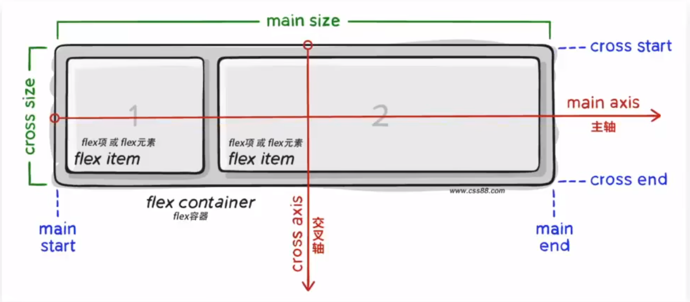

## 手机web
####　移动端特点
PC屏幕大，网页固定版心
**手机屏幕小，网页宽度多数为100%**

#### 网页手机模拟器
不懂就去百度

#### 分辨率
不多做说明,**写网页参照逻辑分辨率**

#### 视口
使用meta标签设置视口宽度，制作适配不同设备宽度的网页
保证网页分辨率(默认宽度是：980px)和设备逻辑分辨率相同
`<meta name="viewport" content="width=device-width, initial-scale=1.0">`

#### 二倍图
**二倍图：相比较于逻辑分辨率大一倍的图**

<br> <br>

#### 百分比布局：
**百分比布局，也叫流式布局
==宽度自适应，高度固定==。**


#### Flex布局：
Flex布局/弹性布局：**是一种浏览器提倡的布局模型**
布局网页更简单、灵活,同时避免浮动脱标的问题

<br>

**Flex布局模型构成**

**作用：**

基于Flx精确灵活控制块级盒子的布局方式，避免浮动布局中脱离文档流现象发生。
Flex布局非常适合结构化布局

**设置方式：**

给**父元素**添加 ` display:flex ` ,子元素可以自动的挤压或拉伸（类似浮动）

**组成部分：**

**父元素是弹性容器
子元素是弹性盒子
主轴，默认向主轴排序
交叉轴 / 侧轴**



---

**主轴对齐方式**

` justify-content:`
通过对主轴对齐方式的设置，让盒子产生间距

` flex-start `默认值，起点开始依次排列
` flex-end `终点开始依次排列

` center `沿主轴居中排列 **(水平居中，无间距)**
` space-around `弹性盒子沿主轴均匀排列，空白间距均分在弹性盒子两侧 **(子级中间间距比较大，左右两边比较小)**
` space-between `弹性盒子沿主轴均匀排列，空白间距均分在相邻盒子之间 **(间距在子级之间)**
` space-evenly `弹性盒子沿主轴均匀排列，弹性盒子与容器之间间距相等 **(所有地方的间距都相同)**

**侧轴对齐方式**

` align-items: ` 添加到弹性容器
` align-self: ` **控制某一个弹性盒子**在侧轴的对齐方式

` flex-start ` 默认值，起点开始依次排列
` flex-end ` 终点开始依次排列

` center ` 沿侧轴居中排列 **(相当于垂直居中)**
` stretch ` ==默认值==，弹性盒子沿着主轴线被拉伸至铺满容器 **（拉伸，子级没高度才会被拉伸）** 


**如果弹性盒子没给高度，那么弹性盒子的高度会变得和父级一样，宽度默认看内容**

**伸缩比**
` flex: 值 `    使用 flex 属性修改弹性盒子**伸缩比**

**注意：只占用父盒子剩余尺寸**

---

**主轴方向：**
` flex-direction: `

**` column ` 列，垂直**
` row `行，水平（默认值）
` row-reverse ` 行，从右向左
` column-reverse ` 列，从下向上

<br><br>

**弹性盒子换行：**
弹性布局，如果放不下，就自动给你调小盒子大小,给容器添加如下属性，就可以保证不够就换行
` flex-wrap:wrap `

**调整行的对齐方式：**
` align-content: ` 

**属性值参考：**

` flex-start `默认值，起点开始依次排列
` flex-end `终点开始依次排列

` center `沿主轴居中排列 **(水平居中，无间距)**
` space-around `弹性盒子沿主轴均匀排列，空白间距均分在弹性盒子两侧 **(子级中间间距比较大，左右两边比较小)**
` space-between `弹性盒子沿主轴均匀排列，空白间距均分在相邻盒子之间 **(间距在子级之间)**

#### 移动适配：
当设备宽度和高度不同时，网页内容的宽度和高度会适配
**rem 和 vw/vh**

#### rem ：
==rem==单位是相对单位
rem单位是==相对于HTML标签的字号==计算结果
**==1 rem = 1 HTML字号大小==**

**屏幕宽度不同，网页元素尺寸不同（等比缩放）**

接下来跳转到：[媒体查询](#媒体查询)

手机屏幕大小不同，分辨率不同，设置不同的 HTML 标签字号


设备宽度不同，使用==媒体查询==，HTML 标签字号设置

**目前rem布局方案中，将网页等分成10份,HTML标签的字号为视口宽度的1/10**

```css
/*视口宽度320px,根字号为32px*/
@media (width:320px){
    html{
        font-size:32px;
    }
}
/*视口宽度375px,根字号为37.5px*/
@media (width:375px){
    html{
        font-size:37.5px;
    }
}
/*视口宽度414px,根字号为41.4px*/
@media(width:414px){
    html{
        font-size:41.4px;
    }
}
```

将 px 转换成 rem ，去计算尺寸大小(假定设计稿适配375px视口)
px / 37.5 = rem 单位尺寸

**flexible**
flexible.js是手淘开发出的一个用来适配移动端的**js框架**
核心原理就是根据**不同的视口宽度**给网页中html根节点设置不同的**font-size**。
这样就可以不写**媒体查询**。

#### 媒体查询：
**媒体查询能够检测视口的宽度，然后编写差异化的CSS样式**

```css
@media(媒体特性){
    选择器{
    CSS属性
    }  
} 
/* 详细写法： */
@media (width:320px){
    html{
    font-size:32px;
    }
}
```
#### Less：
先在VScode 装 ` Easy LESS `
**Less是一个CSS预处理器，Less文件后缀是.less**

使用 Less语法 快速编译生成CSS代码
Less 扩充了CSS语言，使CSS具备一定的逻辑性、计算能力

Less 的单行注释无法生成到CSS文件里面去

除法加 `( ) ` 或者是 ` . `

**Less 嵌套 :**
```less
.father{
    color:▣red;
    .son{
        width:100px;
    }
    &.hover{
        color:pink;
    }
}
// 会生成后代选择器
```
在  Less 中加 ` & ` 代表他自己

**Less 变量：**
定义变量：` @变量名：值： `
使用变量：` CSS属性：@变量名` 

**在Less中导入其他Less**
` @import "文件路径"; `

**导出**
在less文件第一行添加
` // out: ./qqq/ ` 导出到后面相关的路径

` //out:false ` 禁止导出

#### vw / vh :
相对单位
相对视口的尺寸计算结果
vw:viewport width   1vw = 1 / 100视口宽度
vh:viewport height  1vh = 1 / 100视口高度
 
**只能使用一种来开发，反正都一样**

---

#### 熟悉使用 Less 变量来编写 CSS 相关单位，熟悉使用 flex 布局，使用rem / vm / vh 单位来做定位，内外边距，文字大小，行高，以及盒子大小等。

---

## 响应式

#### 响应式网页
一套代码，适配不同的设备

####　响应式媒体查询

**响应式的核心：能够根据设备宽度的变化，设置差异化样式**

**媒体特性常用写法:**
`max-width:` 和 `min-width:`

要么从大到小 `max-width:` ，要么从小到大 `min-width:` ，不要打乱顺序


```css
@media(媒体特性){
    选择器{
    CSS属性
    }  
} 
```
**媒体查询完整写法：(了解)**
`@media 关键词 媒体类型 and (媒体特性){CSS代码}`

关键词：`and` `only` `not`

媒体类型：
`screen` 带屏幕的设备
`print `打印预览模式
`speech` 屏幕阅读模式
`all` 默认值，包括以上3种情形

媒体特性：
`orientation：` 屏幕方向
属性值：
`portrait` 竖屏
`landscape` 横屏

**外链式CSS引入**
` <link rel="stylesheet" media="逻辑符 媒体类型 and (媒体特性)"  href="xx.css"> `

` <link rel="stylesheet"href="./one.css"media="(min-width:992px)"> `

**媒体查询隐藏：**
使用 `display:none;` 隐藏相关的内容

#### BootStrap
使用 ==BootStrap== 框架 ==快速== 开发 ==响应式== 网页

**BootStrap简介**
Bootstrap是由Twitter公司开发维护的前端UI框架，它提供了大量编写好的CSS样式，允许开发者结合一定
HTML结构及JavaScript,快速编写功能完善的网页及常见交互效果。
中文官网: https://www.bootcss.com/

**BootStrap下载**
下载生产环境使用的来使用，源码在使用一段时间之后可以参考学习

**BootStrap使用**
引入 ` bootstrap.min ` 的 CSS

` container ` 类

**BootStrap 栅格系统**

```html
<div class="container">
        <!-- 版心样式，带着左右15px间距 -->
    <div class="row">
            <!-- 取消15px间距，就是抵消上面的 -->
            
            <!--  .container-fluid  带15px内间距的 100% 盒子 -->
        <div class="col-lg-3 col-md-6 col-sm-6 col-xs-12">1</div>
        <div class="col-lg-3 col-md-6 col-sm-6 col-xs-12">2</div>
        <div class="col-lg-3 col-md-6 col-sm-6 col-xs-12">3</div>
        <div class="col-lg-3 col-md-6 col-sm-6 col-xs-12">4</div>
    </div>
</div>
```

**BootStrap 全局样式**
https://v3.bootcss.com/css/#overview

查看表格，按钮

**BootStrap 组件**
https://v3.bootcss.com/components/

**BootStrap 插件**
需要引入 jq 和 相关的 js 文件
https://v3.bootcss.com/javascript/


