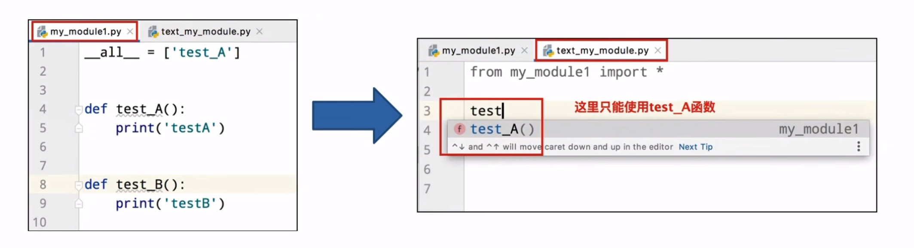

## Python 异常

### 什么是异常
当检测到**一个错误**时，Python解释器就**无法继续执行**了，反而**出现了一些错误**的提示，这就是所谓的 **“异常”**，也就是我们常说的 ==**BUG**==

### 异常的捕获

世界上没有完美的程序，任何程序在运行的过程中，都有可能出现：异常，也就是出现bug
导致程序无法完美运行下去。
我们要做的，不是力求程序完美运行。
而是在力所能及的范围内，对可能出现的ug,进行提前准备、提前处理。
这种行为我们称之为：**异常处理（捕获异常）**

当我们的程序遇到了**BUG**,那么接下来有两种情况：
1. **整个程序因为一个BUG停止运行**
2. **对BUG进行提醒，整个程序继续运行**

显然在之前的学习中，我们所有的程序**遇到 BUG 就会出现 1 的这种情况**，也就是整个程序直接奔溃，
但是在真实工作中，我们肯定不能因为一个小的 BUG 就让整个程序全部奔溃，也就是我们希望的是达到 2 的这种情况
那这里我们就需要使用到**捕获异常**
==**捕获异常的作用在于：提前假设某处会出现异常，做好提前准备，当真的出现异常的时候，可以有后续手段。**==

#### 捕获常规异常的语法：
```python
try:
    可能发生错误的代码
except:
    如果由现异常执行的代码
```

#### 捕获指定异常
```python
try:
    print(name)
except NameError as e:  # 这里的 e 是一个异常对象，保存了原来的抛出异常信息
    print('name变量名称未定义错误')
```
**注意事项:**
- 如果尝试执行的代码的异常类型和要捕获的异常类型不一致，则无法捕获异常。
- 一般try下方只放一行尝试执行的代码。

#### 捕获多个异常
**当捕获多个异常时，可以把要捕获的异常类型的名字，放到except后，并使用元组的方式进行书写**。
```python
try:
    print(1 / 0)
except (NameError,ZeroDivisionError) as e:  # 这里的 e 是一个异常对象，保存了原来的抛出异常信息
    print('ZeroDivision错误..')         # as e 也可以不写
```

#### 捕获所有异常：

**有两种方法，一种就是捕获常规异常的那个，一个是这种**

```python
try:
    可能会出现异常的语句
except Exception as e:
    print("捕获所有异常的语法2")
```

#### 异常的else 和 finally 语法 (可以写的也可以不写的)
**else:**
```python
try:
    print(1)
except Exception as e:
    print(e)
else:
    print('我是else,是没有异常的时候执行的代码')
```
**finally 是无论是否出现异常都要执行的语法:**
```python
try:
    f = open('test.txt','r')
except Exception as e:
    f = open('test.txt','w')
else:
    print('没有异常，真好')
finally:
    f.close()
```
### 异常的传递性：
**异常是具有传递性的**
**当函数func01中发生异常，并且没有捕获处理这个异常的时候，异常
会传递到函数func02,当func02也没有捕获处理这个异常的时候
main函数会捕获这个异常，这就是异常的传递性
提示：
当所有函数都没有捕获异常的时候，程序就会报错**


## Python 模块
Python模块(Modul),是一个Python文件,以 .py 结尾，**模块能定义函数**，类和变量模块里也能包含可执行的代码

模块的作用：python中有很多各种不同的模块，每一个模块都可以帮助我们快速的实现一些功能，比如实现和时间相关的功能就可以使用time模块，我们可以认为**一个模块就是一个工具包**，每一个工具包中都有各种不同的工具供我们使用进而实现各种不同的功能.

**大白话：模块就是一个Python文件，里面有类、函数、变量等，我们可以拿过来用（导入模块去使用）**

#### 模块的导入
**模块在使用前需要先导入导入的语法如下：**
` [from 模块名] import [模块|类|变量|函数| *] [as 别名]`
**常用的组合形式如：**
- import 模块名
- from 模块名 import 类、变量、方法等
- from 模块名 import *
- import 模块名 as 别名
- from 模块名 import 功能名 as 别名

```python
import 模块名
import 模块名1，模块名2
模块名.功能名()


from 模块名 import 功能名
功能名()

from time import * # 不用 time. 了
sleep(5)  

from time import sleep as sl # 不用输那么多了
sl(5)  
```
#### 自定义模块
Python中己经帮我们实现了很多的模块.不过**有时候我们需要一些个性化的模块，可以通过自定义模块实现，也就是自己制作一个模块**

模块就是一个python文件，只要名字正常就行，按**标识符的命名规则**来

**注意事项：当导入多个模块时，有同名的方法，只有后面的生效**

**==导入模块时，会运行 模块内的代码==**

`__main__` :在python中，有一个内置变量 ` __name__ `,如果运行这个文件，那么它的值就会变成 ` __main__ `
只是导入模块，不会影响到 `__name__`的值，所以可以根据这个来做一个模块的验证功能

```python
if __name__ == '__main__':
    模块的测试代码
    # 这里的代码，被导入时，不会执行
```

**_all_:**
如果一个模块文件中有`__all__`变量，当使用 ` from xxx import *  `为导入时，只能导入这个列表中的元素


## Python 包
**从物理上看**，包就是一个**文件夹**，在该文件夹下包含了` __init__.py `文件，该文件夹可用于包含多个**模块文件**
**从逻辑上看，包的本质依然是模块**


**包的作用：**
当我们的模块文件越来越多时，包可以帮助我们管理这些模模块，包的作用就是包含多个模块，但包的本质依然是模块

#### 自定义包：
1. 新建包` my_package`
2. 新建包内模块：`my_module1`和`my module2`
3. 新建一个 `__init__.py` 文件 
**导入包**
```python
# 方式一：
import 包名.模块名
包名.模块名.目标

import my_package.my_module1
import my_package.my_module2

#方法2
my_package.my_module1.info_print1()
#my_package.my_module2.info_print2()
from my_package import my_module1
from my_package import my_module2

my_module1.info_print1()
my_module2.info_print2()
# 方法3
from my_package.my_module1 import info_print1
from my_package.my_module2 import info_print2
info_print1()
info_print2()

```
`__all__` 可以写在 init.py 里控制 * 导入的模块
`__all__ = ['my_module1']`
`__all__ = ['模块名']`

#### 第三方的包：
我们知道，包可以包含一堆的Python模块，而每个模块又内含许多的功能。
所以，我们可以认为：**一个包，就是一堆同类型功能的集合体。**
在 Python 程序的生态中，有**许多非常多的第三方包（非Python官方）**，可以极大的帮助我们提高开发效率，如：
- 科学计算中常用的：numpy包
- 数据分析中常用的：pandas包
- 大数据计算中常用的：pyspark、apache-flink包
- 图形可视化常用的：matplotlib、pyecharts
- 人工智能常用的：tensorflow
- 等


**安装第三方包-pip：**
第三方包的安装非常简单，我们只需要使用` Python `内置的 ` pip `程序即可。
**打开我们许久未见的：命令提示符程序，在里面输入：**
**` pip install 包名称 `**
**即可通过网络快速安装第三方包**

**由于pip是连接的国外的网站进行包的下载，所以有的时候会速度很慢。**
我们可以通过如下命令，**让其连接国内的网站进行包的安装**：
` pip install -i https:/pypi.tuna.tsinghua.edu.cn/simple 包名称 `


` https://pypi.tuna.tsinghua.edu.cn/simple `**是清华大学提供的一个网站，可供pip程序下载第三方包**

