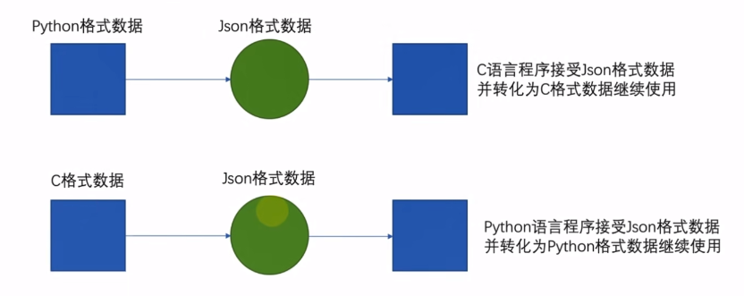

# Python
- 简洁、高效
- 应用场景丰富
- 面向对象
- 解释型语言(无需编译)
  
基于Python最新版

## 初识 Python 

#### Python 的特点
- 简单
- 易学
- 开发效率高
- 适用面非常广泛

#### 什么是编程语言
编程语言用来和计算机交流的语言，中间需要一个翻译官（编译器）。
自然语言比编程语言复杂，不能用自然语言去和计算机交流。

#### 安装Python (Windows)
www.python.org

找到Python最新版，下载之后并安装。


==**注意框框里面的**==


==**下一步**==

选择安装路径，下一步，等等安装完成。
==**最后注意这个。**==


#### 验证安装
`win + R `打开运行 输入 ` cmd ` 在 **cmd** 里 输入 ` python ` 回车，出现如下代表进入python解释器，安装成功。

`exit()`可以退出python解释器。


#### 第一个 Python 程序 Hello World

和上面一样，`win + R `打开运行 输入 ` cmd ` 在 **cmd** 里 输入 ` python ` 回车

输入 ` print ("你好，世界"); `

注意：==**是英文符合!   是英文符合!    是英文符合!**==

#### Python 解释器
Python解释器，是一个计算机程序，用来翻译Python代码，并提交给计算机执行。
所以，它的功能很简单，就两个:
1. 翻译代码 （0 和 1）
2. 提交给计算机运行


如果按照 Hello World 的方法去写代码，会发现，一次只能运行一条代码。
我们可以将代码，写入一个以`.py `结尾的文件中，使用python命令去运行它。

#### 开发环境
Visual Studio Code 
PyChatm

## Pytho 基础内容

#### 字面量：
**字面量：在代码中，被写下来的的固定的值，称之为字面量**

**常用的值的类型**


**字符串（string），又称文本，是由任意数量的字符如中文、英文、各类符号、数字等组成。所以叫做字符串**

---

**如何描写？**


`print( ) ` **输出语句**

```python
6666
13.14
-13.14
"你好，我是字符串。"
print(6666) 
print(13.14) 
print("你好，我是字符串。")
```

#### 注释：
- 单行注释：==**以 `#`开头**==，`#`右边的所有文字当作说明，而不是真正要执行的程序，起==辅助说明作用==
**注意，#号和注释内容一般建议以一个空格隔开**

- 多行注释： 以 ==**一对三个双引号**== 引起来（"""注释内容""")来解释说明一段代码的作用使用方法
```PYTHON
# 我是单行注释
print("你好，我是字符串。")

"""
    我是多行注释
    我是多行注释
    我是多行注释
    我是多行注释
"""

print("你好，我是字符串。")
```

#### 变量:
**变量：==在程序运行时==**，能 **==储存计算结果==** 或能 **==表示值==** 的抽象概念。
简单的说，变量就是在程序运行时，记录数据用的


`print(内容1,内容2,内容3,...)`

```python
money = 50
print("你还有",money,"块钱")
# 你还有50块钱
money = money - 10
print("你还有",money,"块钱")
# 你还有40块钱
```

#### 数据类型:
` type( ) ` 判断数据类型

```python
money = 60
# 方法一
print(type(50.2))
# 方法二
print(type(money))
# 方法三
money = "我是str"
money_type =type(money)
print(money_type)

# 结果：
# <class 'float'>
# <class 'int'>
# <class 'str'>
```

#### 数据类型的转换:
- 从文件中读取的数字，默认是字符串，我们需要转换成数字类型
- 后续学习的input()语句，默认结果是字符串，若需要数字也需要转换
- 将数字转换成字符串用以写出到外部系统
- 等等
  
**转换代码:**
`int(x) `   将x转换为一个整数
`float(x)`  将x转换为一个浮点数
`str(x)`    将x转换为字符串

同前面学习的type语句一样,这三个语句,都是**带有结果的（返回值）**
我们**可以用print直接输出**

==**什么都可以转换成字符串，但不是什么字符串（必须只有数字才行）都可以转换成整数**==

==**浮点数转换成整数，会丢失精度（小数部分没了）**==


#### 标识符:
在Python程序中，我们可以给很多东西起名字，比如：
- 变量的名字
- 方法的名字
- 类的名字,等等

这些名字，我们把它统一的称之为标识符，用来做内容的标识。
所以，**标识符：是用户在编程的时候所使用的一系列名字，用于给变量、类、方法等命名。**

**标识符命名规则:**
Python中，标识符命名的规则主要有3类:
- **内容限定**
- **大小写敏感**
- **不可使用关键字**

**标识符命名规则-内容限定:**
标识符命名中，只允许出现：
- **英文**
- ~~**中文**~~
- **数字**
- **下划线（ ）**
  
这四类元素,其余任何内容都不被允许。

**注意事项：**
1. **不推荐使用中文**
2. **不能以字母为开头**

---

**关键字:**


学完了标识符（变量、类、方法）的命名规则后，我们在来学习标识符的命名规范。
**变量命名规范:**

- 见名知意
- 下划线命名法
- 英文字母全小写(用小驼峰法比较习惯)
  
#### 补充:

**小驼峰法：**
变量一般用小驼峰法标识。驼峰法的意思是：除第一个单词之外，其他单词首字母大写。
`myStudentCount `
**大驼峰法:**
相比小驼峰法，大驼峰法（即帕斯卡命名法）把第一个单词的首字母也大写了。常用于类名，属性，命名空间等。
` DataBaseUser `

**代码规范：**
**运算符左右加空格。**


#### 运算符:

**算术运算符：**


` c//=a `  等效于 ` c = c ** a `


#### 字符串扩展:

**字符串的三种定义方式:**
字符串在Python中有多种定义形式：
1. 单引号定义法：`name = '你好' `
2. 双引号定义法：`name = "你好" `
3. 三引号定义法：` name = """你好""" `

三引号定义法，和多行注释的写法一样，同样支持换行操作。
**使用变量接收它，它就是字符串
不使用变量接收它，就可以作为多行注释使用。**

**字符串的引号嵌套：**
- 单引号定义法，可以内含双引号
- 双引号定义法，可以内含单引号
- 可以使用转移字符（\）来将引号解除效用，变成普通字符串
  
**字符串的拼接:**
如果我们有两个字符串（文本）字面量，可以将其拼接成一个字符串，通过` + `号即可完成，如:
` print("我是"+"大天才") `
输出结果：
`我是大天才`

不过一般，单纯的2个字符串字面量进行拼接显得很呆，一般，字面量和变量或变量和变量之间会使用拼接，如:
` name = "周" `
` print("我的名字是：" + name + "，我可以吃饭。") `

**注意： 无法和非字符串类型进行拼接**


**字符串的格式化:**
我们会发现，这个拼接字符串不好用
1. 变量过多，拼接起来实在是太麻烦了
2. 字符串无法和数字或其它类型完成拼接。

我们可以通过如下语法，完成字符串和变量的快速拼接。
```python
name = 10086
message = "你好，我是%s" % name

# 针对多个，用括号，并且顺序不能乱
iphone = 12345678910
message = "你好，我是%d,你的手机号码%d，已经没钱了捏。" % (name,iphone)
```
其中的 `% 和 s`
` % ` 表示：我要占位
` %s ` 表示：将**变量变成字符串**放入占位的地方
` %d ` 表示：将**变量变成整数**放入占位的地方
` %f ` 表示：将**变量变成浮点数**放入占位的地方
所以，综合起来的意思就是：我先占个位置，等一会有个变量过来，我把它变成某种类型放到占位的位置


**格式化的精度控制:**
我们可以使用辅助符号"m.n"来控制数据的宽度和精度
`m `，控制宽度，要求是数字（很少使用）,**设置的宽度小于数字自身，不生效**
` .n`，控制小数点精度，要求是数字，**会进行小数的四舍五入**

**例子:**
` %5d `：表示将整数的宽度控制在5位，如数字11，被设置为 5d，就会变成：[空格][空格][空格]11，用三个空格补足宽度。

` %5.2f `：表示将宽度控制为5，将小数点精度设置为2
小数点和小数部分也算入宽度计算。如，对11.345设置了%7.2f 后，结果是：[空格][空格]11.35。2个空格补足宽
，小数部分限制2位精度后，四舍五入为.35

` %.2f `：表示不限制宽度，只设置小数点精度为2，如11.345设置%.2f后，结果是11.35

---

**字符串的格式化方式 —— 二:**
` f "内容 { 变量 } 内容2 { 变量2 } " ` 的格式来快速格式化

这种方法**不限制数据类型，但不能做精度控制。**


**对表达式进行格式化:**
**表达式：一条具有明确执行结果的代码语句**

`print(f"1 * 1 = { 1 * 1}") `
`print("1 * 1 = %d" % (1 * 1))  `

#### input 数据输入语句:
使用 ` input()语句 `可以从键盘获取输入
使用一个变量接收（存储）input语句获取的键盘输入数据即可
` name = input() ` 
` name = input("输入你的名字:") ` **括号里面可以带提示内容**

==**input返回的值是字符串,注意转换数据类型**==

` num = int(input("输入你的名字:") )` `

## Python 判断语句

#### 布尔类型和比较运算符
**布尔类型：**
布尔（bool）表达现实生活中的逻辑，即真和假
True表示真
False表示假。
**True**本质上是一个数字记作 ` 1  `,**False**记作 ` 0`

**比较运算符：**


#### if 语句
```python
    age = 18
# if 条件 :
#     执行代码（ 前面一个tab缩进）
    if age >= 18:
        print("你至少等于 18 捏")
    print("这里已经不是if的东西了")
```
**if语句的注意事项：**
- 判断条件的结果一定要是布尔类型
- 不要忘记判断条件后的：冒号
- 归属于if语句的代码块，需在前方填充4个空格缩进


#### if else 语句
```python
    age = 18
# if 条件 :
#     执行代码（ 前面一个tab缩进）
# else:
#     执行代码
    if age >= 18:
        print("你至少等于 18 捏")
    else:
        print("你居然小于 18 捏")
    print("这里已经不是if的东西了")
```

#### if elif else 语句（有点像 switch ）
```python
# if 条件1:
#     条件1的代码
# elif 条件2:
#     条件2的代码
# elif 条件3:
#     条件3的代码
# else :
#     都不满足的代码
```
**注意事项：**
- elif可以写多个
- 判断是互斥且有序的，上一个满足后面的就不会判断了
- 可以在条件判断中，直接写input语句，节省代码量

#### 判断语句的嵌套
- 嵌套判断语句可以用于多条件、多层次的逻辑判断
- 嵌套判断语句可以根据需求,自由组合if elif else来构建多层次判断
- 嵌套判断语句，一定要注意空格缩进，Python通过空格缩进来决定层次关系

**嵌套的关键点，在于：空格缩进
通过==空格缩进==，来决定语句之间的：==层次关系==**

## Python 循环语句
**循环的逻辑：**


#### while 循环的基础语法:
```python
while 条件:
    代码1
    代码2
    代码3
    ...
```
1. while的条件需得到布尔类型，True表示继续循环，False表示结束循环
2. ==需要设置循环终止的条件==，如 **i+=1** 配合 **i<100** ，就能确保100次后停止，**否则将无限循环**
3. 空格缩进和if判断一样，都需要设置

#### 随机数代码
` import random `
` num = random.randint(1,100)  `

**建议练习一个猜数字的案例**

#### while 嵌套
**和if的差不多**


外层循环一次，里层循环完整执行一次

**补充知识：**


**ps: ` end=' ' `是使用的方法传参功能**

#### for 循环
- while循环的循环条件是自定义的，自行控制循环条件
- for循环是一种“轮询”机制，是对一批内容进行“逐个处理”

```python
#定义字符串nme
name = "hello”
#for循环处理字符串
for x in name:
print(x)
# 运行结果：
# h
# e
# l
# l
# o
```
**同while循环不同，==for循环是无法定义循环条件==的。**
只能从被处理的数据集中，依次取出内容进行处理。
所以，理论上讲，==Python的for循环无法构建无限循环==（被处理的数据集不可能无限大）


##### range语句
语法中的：**待处理数据集**，严格来说，称之为：**序列类型**
序列类型指，**其内容可以一个个依次取出**的一种类型，包括:
- 字符串
- 列表
- 元组
- 等

目前我们只学习了字符串类型，其余类型在后续章节会详细学习它们

for循环语句，本质上是==遍历：序列类型==。
尽管除字符串外，其它的序列类型目前没学习到，但是不妨碍我们通过==学习**range**语句，获得一个简单的数字序列==。
**语法1:**
 ` range(num) `
获取一个从 0 开始，到 num 结束的数字序列（**不含num本身**）
如 `range(5) `取得的数据是：[0,1,2,3,4]

**语法2：**
`range(num1, num2)`
获得一个从num1开始，到num2结束的数字序列（**不含num2本身**）
如，`range(5,10)`取得的数据是：[5,6,7,8,9]

**语法3:**
` range(num1, num2,step) `
获得一个从num1开始，到num2结束的数字序列（**不含num2本身**）
数字之间的步长，以step为准（step默认为1)
如,`range(5,10,2)`取得的数据是：[5,7,9]


##### for循环的变量作用域
回看for循环的语法，我们会发现，将从数据集（序列）中取出的数据赋值给：临时变量为什么是临时的呢?

**临时变量，在编程规范上，作用范围（作用域），只限定在for循环内部**

如果在for循环外部访问临时变量：
- **实际上是可以访问到的**
- ==**在编程规范上，是不允许、不建议这么做的**==
- **如需访问临时变量，可以预先在循环外定义它**

#### for循环的嵌套使用
参考 while 循环嵌套，大差不差

#### 循环中断 break 和 continue
**continue：**
continue关键字用于：==**中断本次循环，直接进入下一次循环**==
continue可以用于：for循环和while循环，效果一致

**应用场景：
在循环中，因某些原因，临时结束本次循环。**

```python
for x in range(1,100):
    print("你好")
    continue
    print("我是python")
```
如上代码，`print("我是python")` 并不会执行


**break：**
break关键字用于：==**直接结束循环**==
break可以用于：for循环和while循环，效果一致


## Python 函数
函数：**是组织好的，可重复使用**的，用来实现特定功能的**代码段。**

#### 函数的定义:
**定义：**
```python
def 函数名(传入参数):
    函数体
    return 返回值
```

**返回值也可以省略**

**调用：**
`函数名(参数)` **没有参数可以省略**

==**注意事项：先定义，后调用**==


#### 函数的参数：
传入参数的功能是：在函数进行计算的时候，**接受外部（调用时）提供的数据**
```python
def add(x,y)
    result = x + y
    print(f"{x} + {y}的结果是:{result}")
add(5,6)
```
- 函数定义中，提供的x和y，称之为：**形式参数（形参）**，表示函数声明将要使用2个参数
    - **参数之间使用逗号分隔**

- 函数调用中，提供的5和6，称之为：**实际参数（实参）**，表示函数执行时**真正使用的参数**值
    - 传入的时候，按照顺序传入数据，使用**逗号分隔**


#### 函数的返回值:
**return ：所谓“返回值”，就是程序中函数完成事情后，最后给调用者的结果**
**return 关键字后面的代码不会执行**

#### 返回值的None类型：
如果函数没有使用return语句返回数据，实际上函数有返回值
Python中有一个特殊的字面量：**None**，其类型是： ` <class 'NoneType)> `
无返回值的函数，实际上就是返回了：**None** 这个字面量

**None**表示：**==空的、无实际意义的意思==**
函数返回的**None**，就表示，这个函数没有返回什么有意义的内容。
也就是 **==返回了空的意思==** 。

<br>

**使用场景：**

**==None==作为一个特殊的字面量，用于表示：空、无意义，其有非常多的应用场景。**
- 用在函数无返回值上
- 用在if判断上
    - **在if判断中，None 等同于 False**
    - **一般用于在函数中主动返回 None，配合 if 判断做相关处理**
- 用于声明无内容的变量上
    - 定义变量，但暂时不需要变量有具体值，可以用**None**来代替
    `name = None `

```python
    if not 条件:
        代码
```

**==not== 表示反转**

<br>

#### 函数的说明文档：
**我们可以给函数添加说明文档，辅助理解函数的作用。**


**注意事项：**
- **通过多行注释的形式，对函数进行说明解释**
- **内容应写在函数体之前**

<br>

#### 函数的嵌套调用：
所谓**函数嵌套调用**指的是**一个函数里面又调用了另外一个函数**

**执行流程：
函数A中执行到调用函数B的语句，会将函数B全部执行
完成后，继续执行函数A的剩余内容**


#### 变量的作用域：
变量**作用域**指的是变量的作用范围（变量==在哪里可用，在哪里不可用==）
主要分为两类：==**局部变量和全局变量**==
所谓**局部变量**是 ==**定义在函数体内部的变量，即只在函数体内部生效**==
所谓**全局变量**，指的是在 ==**函数体内、外都能生效的变量**==
```python
def testA():
    num = 100
    print(num)
testA() # 100
print(num)  # 报错：name 'num' is not defined
```

==**局部变量:在函数体内，临时保存数据，在函数调用完成之后立刻销毁。**==


==**注意：函数内部的全局变量和真正的全局变量没有任何关系，只是值一样**==

**global 关键字：**
`global 全局变量 `
==**使用 global关键字 可以在函数内部声明变量为全局变量**==
    **解决了在函数内部无法修改全局变量的情况**


## 数据容器


**一种可以容纳多份数据的数据类型，容纳的每一份数据称之为1个元素
每一个元素，可以是任意类型的数据，如字符串、数字、布尔等。**

**数据容器可以容纳多份数据**

数据容器根据特点的不同，如：
- 是否支持重复元素
- 是否可以修改
- 是否有序，等

分为5类，分别是:
**列表（list）、元组（tuple）、字符串（str）、集合（set）、字典（dict)**

### 列表  (==这玩意很像进化版数组==)：

#### 列表的基本语法：**
```python
# 字面量
[1,2,3,4,5,6,7]

# 定义变量
变量名称 = [1,2,3,4,5,6,7]

# 定义空列表
变量名称 = []
变量名称 = list()
```
列表内的 ==**每一个数据，称之为元素**==
- **以[ ]作为标识**
- **列表内每一个元素之间用，逗号隔开**
- **列表可以嵌套**

#### 下标索引：

**列表中的每一个元素，都有其位置下标索引，从前向后的方向，从 0 开始，依次递增**
**可以反向索引，也就是从后向前：从-1开始，依次递减(-1、-2、-3......)**

==**索引超过就报错**==

#### 列表的常用操作：
以外，列表也提供了一系列功能：
- 插入元素
- 删除元素
- 清空列表
- 修改元素
- 统计元素个数

等等功能，这些功能我们都称之为：==**列表的方法**==

在Python中，**如果将函数定义为class（类）的成员，那么函数会称之为：方法**


**方法和函数功能一样，有传入参数，有返回值，只是方法的使用格式不同：**


**查找某元素的下标：**
功能：查找指定元素在列表的下标，如果找不到，报错ValueError
语法：` 列表.index(元素) `
` index `就是列表对象（变量）内置的方法（函数）

**修改特定位置（索引）的元素值：**
语法：` 列表[下标]=值 `
可以使用如上语法，直接对指定下标（正向、反向下标均可）的值进行：重新赋值（修改）

**插入元素：**
语法：` 列表.insert(下标,元素) `,在指定的下标位置,插入指定的元素
```python
my_list = [1,2,3]
my_list.insert(1, "python")
print(my_list)
# 结果：[1,"python", 3, 4]
```

**追加元素：**
语法： ` 列表.append(元素) `，将指定元素，追加到列表的**尾部**

**追加元素方式2：**
语法：` 列表.exteng(其它数据容器) `，将**其它数据容器**的内容取出，依次追加到列表尾部

**删除元素：**
语法1: ` del 列表[下标] `
语法2：` 列表.pop(下标) ` **相当于取出,可以使用变量保存取出的值**
语法3：` 列表.remove(元素) ` **从前到后，找到了匹配的元素，删除第一个**

**清空列表内容：** ` 列表.clear() `

**统计==某元素==在列表内的数量:**
语法：` 列表.count(元素) `

**统计列表内，有多少元素:**
语法：` len(列表) `

==**返回一个int类型的值**==

**总结：**


#### 列表的循环遍历
既然数据容器可以存储多个元素，那么，就会有需求从容器内依次取出元素进行操作。
将容器内的元素依次取出进行处理的行为，称之为：**遍历、迭代。**

**while循环：**


**for循环：**


**while循环和for循环，都是循环语句，但细节不同：**
- 在循环控制上：
    - while循环可以自定循环条件,并自行控制
    - for循环不可以自定循环条件,只可以一个个从容器内取出数据
- 在无限循环上：
    - while循环可以通过条件控制做到无限循环
    - for循环理论上不可以,因为被遍历的容器容量不是无限的
- 在使用场景上：
    - while循环适用于任何想要循环的场景
    - for循环适用于，遍历数据容器的场景或简单的固定次数循环场景

**for循环更简单，while更灵活
for用于从容器内依次取出元素并处理，while用以任何需要循环的场景**

### 元组：

**元组同列表一样**，都是可以封装多个、不同类型的元素在内。
但是最大的==不同点==在于：==**元组一旦定义完成,就不可修改**==

#### 元组的定义

元组定义：定义元组使用**小括号**，且使用**逗号**隔开各个数据，**数据可以是不同的数据类型**。

```python
# 定义元组字面量
（元素，元素，......，元素）
# 定义元组变量
变量名称 =（元素，元素，......，元素）
# 定义空元组
变量名称 = ()       # 方法1
变量名称 = tuple() # 方法2
```
==**注意：元组只有一个数据，这个数据后面要添加逗号**==

` t1 = ('python',) `

#### 元组的方法：


**元组的内容不能修改，会报错**
==**例外：元组里的列表可以修改...**==

### 字符串：

#### 字符串的索引：
和其它容器如：列表、元组一样，**字符串也可以通过下标进行访问**
- 从前向后，下标从 0 开始
- 从后向前，下标从 -1 开始

同元组一样， ==**字符串是一个无法修改**== 的数据容器。

#### 字符串的方法：

**字符串的查找：**
` index(字符串) ` 返回 **查找的字符串** 的 **起始索引**

**字符串的替换**
语法：` 字符串.replace(字符串1，字符串2)`
功能：将字符串内的全部：字符串1，替换为字符串2
==**注意：不是修改字符串本身，而是得到了一个新字符串**==

**字符串的分割：**
语法：` 字符串.split（分隔符字符串） `
功能：按照指定的分隔符字符串，将字符串划分为多个字符串，并存入列表对象中
==**注意：字符串本身不变，而是得到了一个列表对象**==


**字符串的规整操作（去前后空格）**
语法：` 字符串.strip() `


**字符串的规整操作（去前后指定字符串）**
语法： ` 字符串.strip(字符串) ` 
注意：传入的是 12 其实就是： 1 和 2 都会移除，是按照单个字符。

**统计某个字符出现的次数**
`字符串.count()`

**统计字符串的长度**
`len(字符串)`


#### 字符串的遍历 
    ......

### 数据容器的序列和切片
==**序列是指：内容连续、有序，可使用下标索引的一类数据容器**==
**列表、元组、字符串，均可以可以视为序列。**

==**切片：从一个序列中，取出一个子序列**==

**序列支持切片，即：==列表、元组、字符串，均支持进行切片操作==**

语法：` 序列[起始下标:结束下标:步长] `
**表示从序列中，从指定位置开始，依次取出元素，到指定位置结束，得到一个新序列:**
- 起始下标表示从何处开始，可以留空，留空视作从头开始
- 结束下标（不含）表示何处结束，可以留空，留空视作截取到结尾
- 步长表示，依次取元素的间隔
    - 步长1表示，一个个取元素
    - 步长2表示，每次跳过1个元素取
    - 步长N表示，每次跳过N-1个元素取
    - **步长为负数表示，反向取（注意，起始下标和结束下标也要反向标记）**

此操作不会影响序列本身，因为会创造出一个新的序列

**反转:** ` 序列[::-1] `


### 集合：

**集合：不支持元素的重复，内容无序**

#### 集合的定义：
```python
# 定义集合字面量
{元素，元素，...，元素}
# 定义集合变量
变量名称 = {元素，元素，·，元素}
#定义空集合
变量名称 = set()
```

#### 集合的方法：
首先，**因为集合是无序的，所以集合不支持：下标索引访问**

但是集合和列表一样，是允许修改的，所以我们来看看集合的修改方法。

**添加新元素**
语法：` 集合.dd(元素) ` 将指定元素，添加到集合内
结果：集合本身被修改，添加了新元素

**移除元素**
语法：` 集合.remove(元素) `将指定元素，从集合内移除
结果：集合本身被修改，移除了元素

**从集合中随机取出元素**
语法：` 集合.pop() ` 从集合中随机取出一个元素
结果：会得到一个元素的结果。同时**集合本身被修改，元素被移除**

**清空集合**
语法： ` 集合.clear() `清空集合
结果：集合本身被清空

**取出2个集合的差集**
语法：` 集合1.difference(集合2) ` 取出集合1和集合2的差集（集合1有而集合2没有的)
结果：**得到一个新集金，集合1和集合2不变**

**消除2个集合的差集**
语法： ` 集合1.difference update(集合2) `
功能：对比集合1和集合2，在**集合1内，删除和集合2相同的元素**。
结果：**集合1被修改，集合2不变**

**2个集合合并**
语法：` 集合1.union(集合2)` 
功能：将集合1和集合2组合成新集合
结果：**得到新集合，集合1和集合2不变**

**统计集合的元素数量**
`len(集合) `


#### 集合的遍历

**无法使用 while 遍历，因为无法使用下标**

其他差不多


### 字典

可以按 **Key** 找到 **Value**

#### 字典的定义：
字典的定义:**同样使用{ }，不过存储的元素是一个个的：键值对**
```python
#定义字典字面量
{key:valueg key:value,......key:value}
#定义字典变量
my_dict = {key:vaTue,key:value,......key:value}
#定义空字典
my_dict = {}        # 空字典定义方式1
my_dict = dict()    # 空字典定义方式2
```

**注意：**
- **Key 不能重复，如果重复，也只能覆盖老数据**
- **字典的Key和Value可以是任意数据类型(Key不可为字典)，也就是说==可以嵌套==**

#### 字典的方法：

**新增元素**
语法：`字典[Key] = Value ` **key 要不存在**
结果：字典被修改，新增了元素

**更新元素**
语法：`字典[Key] = Value ` **key 要原本就存在**
结果：字典被修改，更新了元素

**删除元素**
语法：` 字典.pop(Key) `
结果：获得指定 Key 的 Value ,同时字典被修改，指定 Key 的数据被删除

**清空字典**
语法：`字典.clear() `


**获取全部的key**
语法：` 字典.keys() `
结果：得到字典中的全部Key

**获取的这个全部 Key 可以用来循环遍历
不过实际上可以直接用 for 来循环遍历**

**字典不能使用 while 循环遍历**


**统计字典的元素数量**
`len(字典)`


### 数据容器的总结


### 数据容器的通用操作
首先，在遍历上：
- 5类数据容器都支持for循环遍历
- 列表、元组、字符串支持while循环，集合、字典不支持（无法下标索引)
尽管遍历的形式各有不同，但是，**它们都支持遍历操作。**

除了遍历这个共性外，数据容器可以**通用非常多的功能方法**
` len(容器) `  统计容器的元素个数
` max(容器) `   统计容器的最大元素
` min(容器) `  统计容器的最小元素


**转换**

` list(容器)  ` 将给定容器转换为列表
字符串会变成一个个字符，字典只有 Key 值，失去了 Value

` str(容器)   ` 将给定容器转换为字符串
字典会有Key 和 Value 都正常，基本上变成一长个字符串

` tuple(容器) ` 将给定容器转换为元组
和列表差不多

` set(容器)   ` 将给定容器转换为集合
重复的去重，数据乱序

` dict() `需要键值对才能转换，所以就当不能转

**通用排序**
`sorted(容器,[reverse=True])`
排完变成列表，所有都是
字符串会变成一个个字符，字典只有 Key 值，失去了 Value，也只排列 Key 值

` sorted(容器,reverse=True) `倒排
` sorted(容器) `正排

**字符串比较大小**
**字符串的大小比较主要是通过 ASCII 码表进行比较**

字符串比较大小是按位比较，也就是一位位进行对比，只要有一位大，那么整体就大。

` ab > a `
` abd > abc `
` key2 > key1 `
` abz > abc `


## Python函数进阶

#### 函数的多返回值
```python
def test_return():
    return 1,2

x,y = test_return()
print(x) # 结果1
print(y) # 结果2

```

**按照返回值的顺序，写对应顺序的多个变量接收即可**
**变量之间用逗号隔开**
**支持不同类型的数据 return**

#### 函数的多种传参方式

**位置参数：**

**位置参数：调用函数时根据函数定义的参数位置来传递参数**
```python
def user_info(name,age,gender):
    print(f'您的名字是{name},年龄是{age},性别是{gender}')

user_info('TOM',20,'男')
```
注意：
==**传递的参数和定义的参数的顺序及个数必须一致**==

**关键字参数：**

**关键字参数：函数调用时通过 ` 键 = 值 ` 形式传递参数，**
作用：可以让函数更加清晰、容易使用，同时也清除了参数的顺序需求
```python

def user_info(name,age,gender)
    print(f"您的名字是：{name},年龄是：{age},性别是：{gender}")

#关键字传参
user_info(name="小明",age=20,gender="男")
#可以不按照固定顺序

user_info(age=20,gender="男",name="小明")
#可以和位置参数混用，位置参数必须在前，且匹配参数顺序
user_info("小明",age=20,gender="男")
```
**注意：**
**函数调用时，如果有位置参数时，==位置参数必须在关键字参数的前面==，但关键字参数之间不存在先后顺序**

**缺省参数:**
**缺省参数：缺省参数也叫默认参数，用于定义函数，为参数提供默认值，调用函数时可不传该默认参数的值（注意：**
所有位置参数必须出现在默认参数前，包括函数定义和调用).
作用：当调用函数时没有传递参数，就会使用默认是用缺省参数对应的值
```python
def user_.info(name,age,gender='男')：
    print(f'您的名字是{name},年龄是{age},性别是{gender}')

user_info('TOM',20)
user_info('Rose',18,)
```
注意：
**函数调用时，如果为缺省参数传值则修改默认参数值，否则使用这个默认值**
**要放在最后，否则报错**

**不定长参数**
**不定长参数：不定长参数也叫可变参数**
用升不确定调用的时候会传递多少个参数（不传参也可以）的场景，
作用：当调用函数时不确定参数个数时，可以使用不定长参数

不定长参数的类型：
- 位置传递
- 关键字传递

**位置传递**
```python
def user info(*args):
    print(args)
#('T0M',)
user_info('TOM')
#(T0M',18)
user info('TOM', 18)
```

注意：
传进的所有参数都会被 args 变量收集，它会根据传进参数的位置合并为**一个元组(tuple)**,args是元组类型，这就是位置传递

**关键字**
```python
def user info(**kwargs):
    print(kwargs)
#{'name':T0M','age':18,'id':110}
user_info(name = 'TOM', age = 18, id = 110)
```

注意：
参数是 “键=值” 形式的形式的情况下，**所有的 “键=值” 都会被 ` **kwargs `接受，同时会根据 “键=值” 组成字典**.

#### 匿名函数

**函数作为参数传递**
```python
def test_func(compute):
    result compute(1,2)
    print(result)

def compute(x,y):
    return x + y

test_func(compute)
#结果：3
```
函数compute,作为参数，传入了test funci函数中使用。
- test func需要一个函数作为参数传入，这个函数需要接收2个数字进行计算，计算逻辑由这个被传入函数决定
- compute函数接收2个数字对其进行计算，compute函数作为参数，传递给了test func函数使用
- 最终，在test funci函数内部，由传入的compute函数，完成了对数字的计算操作

所以，**这是一种，计算逻辑的传递，而非数据的传递**
就像上述代码那样，不仅仅是相加，相见、相除、等任何逻辑都可以自行定义并作为函数传入。

**lambda 匿名函数**
函数的定义中

- def关键字，可以定义带有名称的函数
- lambda关键字，可以定义匿名函数（无名称)

区别：

- 有名称的函数，可以基于名称重复使用。
- 无名称的匿名函数，只可临时使用一次。

**匿名函数定义语法：**
` lambda 传入参数：函数体（一行代码） `
` lambda `是关键字，表示定义匿名函数
传入参数表示匿名函数的形式参数，如：x,y表示接收2个形式参数
函数体，就是函数的执行逻辑，要注意：**只能写一行，无法写多行代码**

也可以通过lambda关键字，传入一个一次性使用的lambda匿名函数
```python   
def test_func(compute):
    result compute(1,2)
    print(result)

test_func(lambda x,y:x + y)  #结果：3

```
使用def和使用lambda,定义的函数功能完全一致，只是lambda关键字定义的函数是匿名的，无法二次使用


## Python 文件操作

#### 文件的编码
编码技术即：**翻译的规则，记录了如何将内容翻译成二进制，以及如何将二进制翻译回可识别内容。**

计算机中有许多可用编码：
- UTF-8
- GBK
- Big5
- ...

**不同的编码，将内容翻译成二进制也是不同的。**

#### 文件的读取操作
想想我们平常对**文件的基本操作**，大概可以分为**三个步骤（简称文件操作三步走）：**
1. 打开文件
2. 读写文件
3. 关闭文件

**注意：可以只打开和关闭文件，不进行任何读写**

**open()打开函数**
在Python,使用open函数，可以打开一个已经存在的文件，或者创建一个新文件，语法如下
` open(name,mode,encoding) `
- name:是要打开的目标文件名的字符串（可以包含文件所在的具体路径）。
- mode:设置打开文件的模式（访问模式）：只读、写入、追加等。
- encoding:编码格式（推荐使用UTF-8)
示例代码：

` f = open('python.txt','r',encoding="UTF-8") `
**encoding的顺序不是第三位，所以不能用位置参数，用关键字参数直接指定**


**read()方法：**
` 文件对象.read(num) `
num 表示要从文件中读取的数据的长度（单位是字节），如果没有传入num,那么就表示读取文件中所有的数据。

**同一个文件对象，读取方法的指针会一直存在，并且会被读取的方法影响。**

**readlines()方法：**
**readlines** 可以按照行的方式把**整个文件中的内容进行一次性读取，并且返回的是一个列表**，其中每一行的数据为一个元素。**(有换行的字符)**
```python
f = open('python.txt')
content = f.readlines()
# ['hello world n','abcdefg n','aaa\n','bbb\n','ccc']
print(content)
#关闭文件
f.close()
```

**readline方法**
` readline() ` 次读取一行内容 **(没有换行的字符)**

**循环读取**
```python 
for line in f:
    print(f"每一行的内容是：{line}")
```

**关闭文件**
` close( ) ` 关闭文件对象

` sleep ( ) ` 程序睡眠,需要导入 time 包

**with open语法**
```python
with open("python.txt","r",encoding="UTF-8") as f:
    for line in f:
        print(f"每一行的内容是：{line}")

#通过在with open的语句块中对文件进行操作
#可以在操作完成后自动关闭close文件，避免遗忘掉close方法
```


#### 文件的写入
```python
#1.打开文件
f = open('python.txt','w',encoding="UTF-8")       # w 模式会覆盖原内容
#2.文件写入
f.write('hello world')
#3.内容刷新
f.flush()
# 或者是直接使用 close ,close 内置了 flush 功能
f.close()
```
**注意：**
- **直接调用 write ,内容并未真正写入文件，而是会积攒在程序的内存中，称之为==缓冲区==**
- **当调用 flush 的时候，内容会真正写入文件**
- 这样做是避免频繁的操作硬盘，导致效率下降（攒一堆，一次性写磁盘）

#### 追加写入操作（和上面的差不多，区别看注意那里）
```python
# 1.打开文件，通过a模式打开即可
f = open('python.txt','a')
# 2.文件写入
f.write('hello world')
# 3.内容刷新
f.flush()
```
**注意：**
- a模式，文件不存在会创建文件
- a模式，文件存在会在最后，追加写入文件

## Python 异常

### 什么是异常
当检测到**一个错误**时，Python解释器就**无法继续执行**了，反而**出现了一些错误**的提示，这就是所谓的 **“异常”**，也就是我们常说的 ==**BUG**==

### 异常的捕获

世界上没有完美的程序，任何程序在运行的过程中，都有可能出现：异常，也就是出现bug
导致程序无法完美运行下去。
我们要做的，不是力求程序完美运行。
而是在力所能及的范围内，对可能出现的ug,进行提前准备、提前处理。
这种行为我们称之为：**异常处理（捕获异常）**

当我们的程序遇到了**BUG**,那么接下来有两种情况：
1. **整个程序因为一个BUG停止运行**
2. **对BUG进行提醒，整个程序继续运行**

显然在之前的学习中，我们所有的程序**遇到 BUG 就会出现 1 的这种情况**，也就是整个程序直接奔溃，
但是在真实工作中，我们肯定不能因为一个小的 BUG 就让整个程序全部奔溃，也就是我们希望的是达到 2 的这种情况
那这里我们就需要使用到**捕获异常**
==**捕获异常的作用在于：提前假设某处会出现异常，做好提前准备，当真的出现异常的时候，可以有后续手段。**==

#### 捕获常规异常的语法：
```python
try:
    可能发生错误的代码
except:
    如果由现异常执行的代码
```

#### 捕获指定异常
```python
try:
    print(name)
except NameError as e:  # 这里的 e 是一个异常对象，保存了原来的抛出异常信息
    print('name变量名称未定义错误')
```
**注意事项:**
- 如果尝试执行的代码的异常类型和要捕获的异常类型不一致，则无法捕获异常。
- 一般try下方只放一行尝试执行的代码。

#### 捕获多个异常
**当捕获多个异常时，可以把要捕获的异常类型的名字，放到except后，并使用元组的方式进行书写**。
```python
try:
    print(1 / 0)
except (NameError,ZeroDivisionError) as e:  # 这里的 e 是一个异常对象，保存了原来的抛出异常信息
    print('ZeroDivision错误..')         # as e 也可以不写
```

#### 捕获所有异常：

**有两种方法，一种就是捕获常规异常的那个，一个是这种**

```python
try:
    可能会出现异常的语句
except Exception as e:
    print("捕获所有异常的语法2")
```

#### 异常的else 和 finally 语法 (可以写的也可以不写的)
**else:**
```python
try:
    print(1)
except Exception as e:
    print(e)
else:
    print('我是else,是没有异常的时候执行的代码')
```
**finally 是无论是否出现异常都要执行的语法:**
```python
try:
    f = open('test.txt','r')
except Exception as e:
    f = open('test.txt','w')
else:
    print('没有异常，真好')
finally:
    f.close()
```
### 异常的传递性：
**异常是具有传递性的**
**当函数func01中发生异常，并且没有捕获处理这个异常的时候，异常
会传递到函数func02,当func02也没有捕获处理这个异常的时候
main函数会捕获这个异常，这就是异常的传递性
提示：
当所有函数都没有捕获异常的时候，程序就会报错**


## Python 模块
Python模块(Modul),是一个Python文件,以 .py 结尾，**模块能定义函数**，类和变量模块里也能包含可执行的代码

模块的作用：python中有很多各种不同的模块，每一个模块都可以帮助我们快速的实现一些功能，比如实现和时间相关的功能就可以使用time模块，我们可以认为**一个模块就是一个工具包**，每一个工具包中都有各种不同的工具供我们使用进而实现各种不同的功能.

**大白话：模块就是一个Python文件，里面有类、函数、变量等，我们可以拿过来用（导入模块去使用）**

#### 模块的导入
**模块在使用前需要先导入导入的语法如下：**
` [from 模块名] import [模块|类|变量|函数| *] [as 别名]`
**常用的组合形式如：**
- import 模块名
- from 模块名 import 类、变量、方法等
- from 模块名 import *
- import 模块名 as 别名
- from 模块名 import 功能名 as 别名

```python
import 模块名
import 模块名1，模块名2
模块名.功能名()


from 模块名 import 功能名
功能名()

from time import * # 不用 time. 了
sleep(5)  

from time import sleep as sl # 不用输那么多了
sl(5)  
```
#### 自定义模块
Python中己经帮我们实现了很多的模块.不过**有时候我们需要一些个性化的模块，可以通过自定义模块实现，也就是自己制作一个模块**

模块就是一个python文件，只要名字正常就行，按**标识符的命名规则**来

**注意事项：当导入多个模块时，有同名的方法，只有后面的生效**

**==导入模块时，会运行 模块内的代码==**

`__main__` :在python中，有一个内置变量 ` __name__ `,如果运行这个文件，那么它的值就会变成 ` __main__ `
只是导入模块，不会影响到 `__name__`的值，所以可以根据这个来做一个模块的验证功能

```python
if __name__ == '__main__':
    模块的测试代码
    # 这里的代码，被导入时，不会执行
```

**_all_:**
如果一个模块文件中有`__all__`变量，当使用 ` from xxx import *  `为导入时，只能导入这个列表中的元素


## Python 包
**从物理上看**，包就是一个**文件夹**，在该文件夹下包含了` __init__.py `文件，该文件夹可用于包含多个**模块文件**
**从逻辑上看，包的本质依然是模块**


**包的作用：**
当我们的模块文件越来越多时，包可以帮助我们管理这些模模块，包的作用就是包含多个模块，但包的本质依然是模块

#### 自定义包：
1. 新建包` my_package`
2. 新建包内模块：`my_module1`和`my module2`
3. 新建一个 `__init__.py` 文件 
**导入包**
```python
# 方式一：
import 包名.模块名
包名.模块名.目标

import my_package.my_module1
import my_package.my_module2

#方法2
my_package.my_module1.info_print1()
#my_package.my_module2.info_print2()
from my_package import my_module1
from my_package import my_module2

my_module1.info_print1()
my_module2.info_print2()
# 方法3
from my_package.my_module1 import info_print1
from my_package.my_module2 import info_print2
info_print1()
info_print2()

```
`__all__` 可以写在 init.py 里控制 * 导入的模块
`__all__ = ['my_module1']`
`__all__ = ['模块名']`

#### 第三方的包：
我们知道，包可以包含一堆的Python模块，而每个模块又内含许多的功能。
所以，我们可以认为：**一个包，就是一堆同类型功能的集合体。**
在 Python 程序的生态中，有**许多非常多的第三方包（非Python官方）**，可以极大的帮助我们提高开发效率，如：
- 科学计算中常用的：numpy包
- 数据分析中常用的：pandas包
- 大数据计算中常用的：pyspark、apache-flink包
- 图形可视化常用的：matplotlib、pyecharts
- 人工智能常用的：tensorflow
- 等


**安装第三方包-pip：**
第三方包的安装非常简单，我们只需要使用` Python `内置的 ` pip `程序即可。
**打开我们许久未见的：命令提示符程序，在里面输入：**
**` pip install 包名称 `**
**即可通过网络快速安装第三方包**

**由于pip是连接的国外的网站进行包的下载，所以有的时候会速度很慢。**
我们可以通过如下命令，**让其连接国内的网站进行包的安装**：
` pip install -i https:/pypi.tuna.tsinghua.edu.cn/simple 包名称 `


` https://pypi.tuna.tsinghua.edu.cn/simple `**是清华大学提供的一个网站，可供pip程序下载第三方包**

## 综合案例：

#### json
- JSON是一种轻量级的数据交互格式。可以按照JSON指定的格式去组织和封装数据
- JS0N本质上是一个带有特定格式的字符串

主要功能：**json就是一种在各个编程语言中流通的数据格式，负责不同编程语言中的数据传递和交互**，类似于：
- 国际通用语言-英语
- 中国56个民族不同地区的通用语言-普通话

各种编程语言存储数据的容器不尽相同，在Python中有字典dict这样的数据类型，而其它语言可能没有对应的字典。

为了让不同的语言都能够相互通用的互相传递数据，JSON就是一种非常良好的中转数据格式。如下图，以Py tho和C语言互传数据为例：


#### json格式数据转化


` json.dumps(data,ensure_ascii=False) ` 中文变成字符，后面加这个参数


